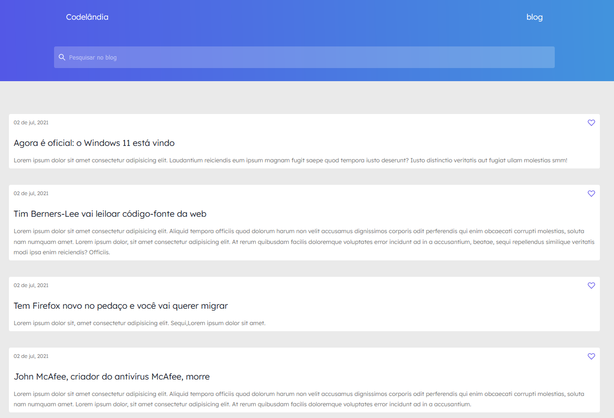

# 
Desafio Codelândia #01 - Iuri Silva

## 
Sobre o projeto

### 
O Codelândia é um site de blogs, desenvolvido por mim para treino de responsividade e uso de SASS.

## 
Tecnologias Utilizadas

- HTML5
- CSS3
- SASS

## <a href="https://www.figma.com/file/Yb9IBH56g7T1hdIyZ3BMNO/Desafios---Codel%C3%A2ndia?node-id=1148%3A2" target="_blank" style="text-decoration: underline; margin-top: 20px;">Link do Figma disponibilizado pelo Iuri para inspiração de design.</a>

## 
Layout do Site

- <a href="https://site-sass-gabriel.netlify.app" target="_blank" style="font-size: 35px; text-decoration: underline; color: #574AE8;">Acesse agora mesmo</a>

## 
Página principal   
